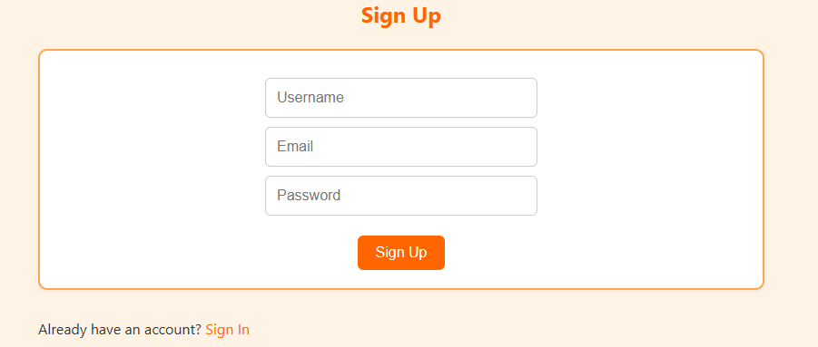
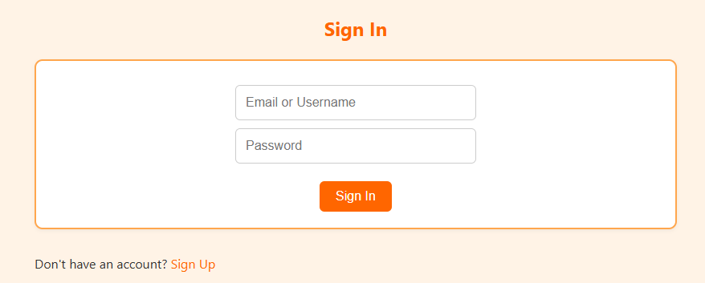
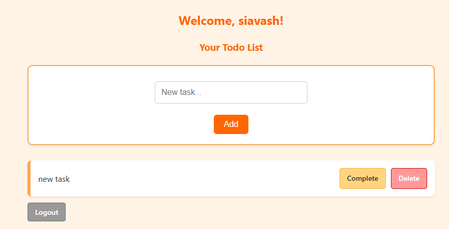

# 🧠 User-Based Todo List (Node.js + MySQL)

This is a full-featured backend web app built with pure Node.js and MySQL — no frameworks like Express or frontend libraries. It allows users to sign up, log in, and manage a personal todo list, with each user's tasks stored securely and separately.

---

## 📸 Screenshots

### 🟠 Sign Up Page  


### 🔑 Sign In Page  


### ✅ Personal Todo List Page  



---

## 🚀 Features

- ✅ User Registration (Sign Up)
- 🔐 User Authentication (Sign In)
- 📝 Add, complete, and delete tasks
- 🧍 Each user has a **private todo list**
- 🍪 Cookie-based sessions (in-memory)
- 💾 MySQL database (users + todos)
- 🎨 Clean UI with orange-themed CSS
- 🧼 Fully modular: signup, signin, and todos in separate files

---

## 📁 Project Structure

project/

├── connection.js # MySQL connection

├── server.js # Main router + session handling

├── auth/

│ ├── signup.js # Signup form + logic

│ └── signin.js # Signin form + logic

├── public/

│ └── style.css # Shared CSS for all pages

└── screenshots/ # Screenshots for README (optional)

---

## 🛠️ Setup Instructions

### 1. Clone and Navigate

```bash
git clone https://github.com/yourusername/user-todo-app.git
cd user-todo-app
2. Install Dependencies
npm install mysql
```
3. Configure the Database
Create a new MySQL database and run the following SQL schema:

```sql
CREATE TABLE users (
  id INT AUTO_INCREMENT PRIMARY KEY,
  username VARCHAR(255) NOT NULL,
  email VARCHAR(255) NOT NULL,
  password VARCHAR(255) NOT NULL
);

CREATE TABLE todos (
  id INT AUTO_INCREMENT PRIMARY KEY,
  user_id INT NOT NULL,
  title VARCHAR(255) NOT NULL,
  completed BOOLEAN DEFAULT FALSE,
  FOREIGN KEY (user_id) REFERENCES users(id)
);
```
Update the database credentials in connection.js.

▶️ Run the App
```bash
node server.js
```
Visit http://localhost:3000/todos in your browser.

---
🎓 Learning Highlights
---
This app was built to strengthen understanding of:

Routing with the native http module

Processing HTML form data with querystring

Session handling using cookies

Working with MySQL queries and user relationships

Serving static assets (like CSS)

Organizing code with modular separation

Building real-world backend apps without frameworks

---
📌 Optional Next Features
---
Password hashing with bcrypt

Persistent sessions stored in a database or file

Edit/update tasks

REST API version for frontend integration

Rate limiting or login attempt protection